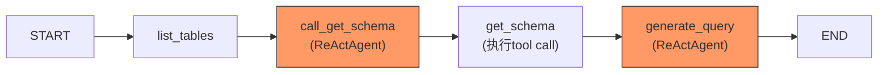

# SQL Agent 执行流程分析报告

## 整体流程概览



**整体耗时：** `18:09:56` → `18:10:13` ≈ **17秒**，共 **6次 LLM 调用**，总消耗 **5732 tokens**

---

## 🔑 发现的核心问题

### 问题1：`get_schema_caller` Agent 的 System Prompt 错误，导致它越权生成了 SQL 并执行

> [!CAUTION]
> 这是最严重的架构问题。`get_schema_caller` 的职责仅是调用 `sql_db_schema` 获取表结构，但它实际上**还调用了 `sql_db_query` 执行了 SQL 查询**。

**原因：** [CallGetSchemaNode.java](file:///Users/zhangshenghao/Documents/work_space/idea_project/agent_study/agent_scope_engine/src/main/java/com/example/agentscope/workflow/sqlagent/node/CallGetSchemaNode.java) 使用的是 `ReActAgent`，它注册了**完整的 `SqlTools`**（包含 `sql_db_schema`、`sql_db_query`、`sql_db_list_tables` 三个工具）。

```java
// CallGetSchemaNode.java 第67-75行
Toolkit toolkit = new Toolkit();
toolkit.registerTool(sqlTools);  // ⚠️ 注册了所有工具，而不是只注册 getSchema
ReActAgent agent = ReActAgent.builder()
        .name("get_schema_caller")
        .sysPrompt(GET_SCHEMA_PROMPT)  // 提示它只调 sql_db_schema
        .model(model)
        .toolkit(toolkit)  // ⚠️ 但实际能调所有工具
        .memory(new InMemoryMemory())
        .build();
```

**Langfuse 日志证据：** `get_schema_caller` 执行了 **3 次 LLM 调用**：

| 轮次 | 时间 | 行为 | Token |
|------|------|------|-------|
| 1 | 10:09:56→10:10:00 | 调用 `sql_db_schema` ✅ 正确 | 344+34=378 |
| 2 | 10:10:00→10:10:03 | **调用 `sql_db_query` 执行 SQL** ❌ 越权 | 1134+151=1285 |
| 3 | 10:10:03→10:10:05 | **输出最终 JSON 结果** ❌ 不该做 | 1370+144=1514 |

`get_schema_caller` 在拿到 schema 后，没有停下来，而是继续用 `sql_db_query` 工具执行了完整的 SQL 查询，**然后把查询结果包在 `json {query: ...}` 格式中返回**。这意味着后面的 `generate_query` Agent 收到的不是 schema 信息，而是**已经执行过的 SQL + 结果**。

### 问题2：`generate_query` Agent 做了重复工作

> [!WARNING]
> 由于 `get_schema_caller` 已经完成了全部工作，`generate_query` 又**重新走了一遍完整流程**：获取 schema → 执行 SQL → 格式化结果。

**Langfuse 日志证据：** `generate_query` 也执行了 **3 次 LLM 调用**：

| 轮次 | 时间 | 行为 | Token |
|------|------|------|-------|
| 1 | 10:10:06→10:10:07 | 调用 `sql_db_schema` 获取表结构 | 606+29=635 |
| 2 | 10:10:07→10:10:10 | 调用 `sql_db_query` 执行 SQL | 1185+155=1340 |
| 3 | 10:10:10→10:10:13 | 输出最终自然语言回答 | 1424+91=1515 |

也就是说 `sql_db_schema` 被调了 **3 次**，`sql_db_query` 被调了 **2 次**，整个查询被**完整执行了 2 遍**。

### 问题3：[ExecuteGetSchemaNode](file:///Users/zhangshenghao/Documents/work_space/idea_project/agent_study/agent_scope_engine/src/main/java/com/example/agentscope/workflow/sqlagent/node/ExecuteGetSchemaNode.java#34-89) 的输出被浪费

> [!NOTE]
> [ExecuteGetSchemaNode](file:///Users/zhangshenghao/Documents/work_space/idea_project/agent_study/agent_scope_engine/src/main/java/com/example/agentscope/workflow/sqlagent/node/ExecuteGetSchemaNode.java#34-89) 正确执行了 `sql_db_schema` 并获取了所有 6 张表的 schema，但这个结果**没有被 `generate_query` 有效利用**。

查看 `generate_query` 收到的 input，它包含了前序步骤的 messages（list_tables 结果 + 上一个 agent 的 SQL 输出），但 `generate_query` 还是自己又调了一遍 `sql_db_schema`。这是因为 ReActAgent 作为一个自主 agent，它会按自己的判断来决策下一步。

### 问题4：`get_schema_caller` 的 System Prompt 与实际行为矛盾

```
System Prompt: "You must call the sql_db_schema tool with a comma-separated list of table names.
Use the available tables from the user message. Do not explain, only output the tool call."
```

Prompt 要求"只输出 tool call"，但 ReActAgent 的机制是**循环执行直到没有 tool call**，所以它拿到 schema 后认为任务没完成，继续调用了 `sql_db_query`。

---

## 📊 Token 浪费统计

| Agent | LLM 调用次数 | 总 Input Tokens | 总 Output Tokens | 总计 |
|-------|-------------|----------------|-----------------|------|
| get_schema_caller | 3 | 2848 | 329 | **3177** |
| generate_query | 3 | 3215 | 275 | **3490** |
| **合计** | **6** | **6063** | **604** | **6667** |

理想情况下只需要 **3 次 LLM 调用**（get_schema 1 次 + generate_query 2 次），**节省约 50% 的 token 和时间**。

---

## ✅ 修复建议

### 方案1：限制 `get_schema_caller` 只注册 `sql_db_schema` 工具（推荐）

在 [CallGetSchemaNode.java](file:///Users/zhangshenghao/Documents/work_space/idea_project/agent_study/agent_scope_engine/src/main/java/com/example/agentscope/workflow/sqlagent/node/CallGetSchemaNode.java#L67-L68) 中，不要注册整个 [sqlTools](file:///Users/zhangshenghao/Documents/work_space/idea_project/agent_study/agent_scope_engine/src/main/java/com/example/agentscope/workflow/sqlagent/SqlAgentConfig.java#72-76)，而是只注册 `getSchema` 方法：

```diff
- Toolkit toolkit = new Toolkit();
- toolkit.registerTool(sqlTools);
+ Toolkit toolkit = new Toolkit();
+ toolkit.registerTool(sqlTools, "getSchema");  // 只注册 getSchema
```

或者如果 AgentScope SDK 不支持按方法注册，可以**创建一个只包含 `getSchema` 的独立 Tool 类**。

### 方案2：不使用 ReActAgent，改为直接 LLM 调用 + 手动解析

既然 `call_get_schema` 的逻辑很简单（就是让 LLM 选择相关表），完全可以不用 ReActAgent，直接调 Model：

```java
// 直接用 model.call() 并 force tool_choice = sql_db_schema
// 手动解析 tool call 参数即可
```

### 方案3：设置 ReActAgent 的 maxSteps=1

如果 AgentScope SDK 支持限制 ReActAgent 的最大迭代步数，将 `get_schema_caller` 的 maxSteps 设为 1，让它只执行一轮 tool call 就停止。

---

## 总结

| 问题 | 严重程度 | 影响 |
|------|---------|------|
| `get_schema_caller` 越权执行 SQL | 🔴 严重 | 职责越界，破坏流程编排 |
| 查询被完整执行 2 遍 | 🟡 中等 | Token 和时间浪费 ~50% |
| Schema 获取被调 3 次 | 🟡 中等 | 不必要的数据库查询 |
| Prompt 与 Agent 机制不匹配 | 🟠 设计缺陷 | ReActAgent 不适合做单步任务 |

**核心根因：[CallGetSchemaNode](file:///Users/zhangshenghao/Documents/work_space/idea_project/agent_study/agent_scope_engine/src/main/java/com/example/agentscope/workflow/sqlagent/node/CallGetSchemaNode.java#42-132) 不应该用 ReActAgent + 全量工具来做"只调一个 tool"的简单任务。**
