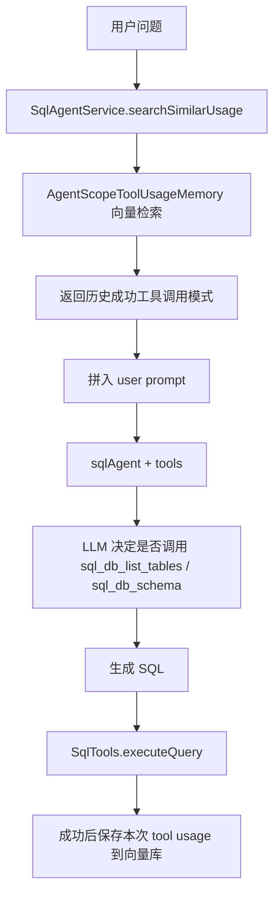

# SQL Agent 工具记忆总结

## 1. 当前目标

当前这套 SQL Agent 工具记忆的目标，不是把数据库 schema 直接长期塞进 prompt，而是沉淀一类更轻量、更稳定的经验：

- 什么问题曾经成功过
- 当时调用了什么工具
- 工具参数是什么

也就是保存：

`question -> toolName -> toolArgs`

这样做的核心价值是：

1. 给 LLM 一个“历史成功模式”提示
2. 缩小它探索候选表和工具调用路径的范围
3. 但不把长期 memory 误当成当前实时 schema

当前最新实现里，**历史命中只作为候选提示，不再由服务层自动展开最新 schema DDL**。  
是否继续调用 `sql_db_list_tables` / `sql_db_schema`，交给 LLM 结合当前会话上下文自己决定。

---

## 2. 当前整体链路

### 2.1 请求流程



### 2.2 当前行为特点

- 会先做向量检索
- 命中的历史模式会被格式化进 prompt
- 不再自动注入 schema DDL
- 不再自动切换到无工具 agent
- 当前会话里如果已经有 schema tool result，LLM 可以直接复用
- 当前会话里如果没有足够 schema 信息，LLM 仍需自己调用 `sql_db_schema`

---

## 3. 关键组件

### 3.1 服务层

- [SqlAgentService.java](/Users/zhangshenghao/Documents/work_space/idea_project/agent_study/agent_scope_engine/src/main/java/com/example/agentscope/workflow/sqlagent/SqlAgentService.java)

职责：

- 检索历史工具调用模式
- 把命中结果拼进 prompt
- 让 `sqlAgent` 自己决定后续 tool 调用
- SQL 成功执行后保存本次工具调用

### 3.2 工具记忆层

- [AgentScopeToolUsageMemory.java](/Users/zhangshenghao/Documents/work_space/idea_project/agent_study/agent_scope_engine/src/main/java/com/example/agentscope/workflow/sqlagent/memory/AgentScopeToolUsageMemory.java)

职责：

- `searchSimilarUsage(...)`
- `saveSuccessfulUsage(...)`

内部依赖：

- AgentScope `Knowledge`
- AgentScope `SimpleKnowledge`
- AgentScope `PgVectorStore`

### 3.3 工具调用记录器

- [SqlToolUsageRecorder.java](/Users/zhangshenghao/Documents/work_space/idea_project/agent_study/agent_scope_engine/src/main/java/com/example/agentscope/workflow/sqlagent/memory/SqlToolUsageRecorder.java)

职责：

- 在一次请求里记录真实发生的 tool 调用
- 当前主要记录：
  - `sql_db_list_tables`
  - `sql_db_schema`

### 3.4 SQL 工具

- [SqlTools.java](/Users/zhangshenghao/Documents/work_space/idea_project/agent_study/agent_scope_engine/src/main/java/com/example/agentscope/workflow/sqlagent/tools/SqlTools.java)

职责：

- 暴露 `sql_db_list_tables`
- 暴露 `sql_db_schema`
- 本地执行 SQL
- 强制租户隔离
- 调用 recorder 记录 tool usage

---

## 4. 向量检索怎么做

### 4.1 向量化对象是什么

当前向量化的主体，是每条成功的工具调用 document。

在 [AgentScopeToolUsageMemory.java](/Users/zhangshenghao/Documents/work_space/idea_project/agent_study/agent_scope_engine/src/main/java/com/example/agentscope/workflow/sqlagent/memory/AgentScopeToolUsageMemory.java) 里，每一条 `RecordedToolUsage` 最终会写成一条 `Document`，其中核心 payload 包括：

- `question`
- `toolName`
- `toolArgsJson`
- `tenantId`
- `userId`
- `userRole`
- `requestId`
- `executedSql`
- `createdAt`

但真正作为 embedding 主文本的，是：

- `question`

也就是说，当前检索的核心是：

**根据“问题文本”的语义相似度，召回历史成功工具调用记录。**

### 4.2 检索参数

当前检索参数定义在 [SqlAgentService.java](/Users/zhangshenghao/Documents/work_space/idea_project/agent_study/agent_scope_engine/src/main/java/com/example/agentscope/workflow/sqlagent/SqlAgentService.java)：

- `MEMORY_SEARCH_LIMIT = 3`
- `MEMORY_SIMILARITY_THRESHOLD = 0.2`

最终传给 AgentScope 的是：

```java
RetrieveConfig config = RetrieveConfig.builder()
        .limit(limit)
        .scoreThreshold(similarityThreshold)
        .build();
```

也就是：

- 最多召回 3 条
- 分数低于 0.2 的不要

### 4.3 检索后还有一层过滤

向量库召回后，不会直接全部拿来用，还会经过：

- 租户范围过滤

对应代码在 [AgentScopeToolUsageMemory.java](/Users/zhangshenghao/Documents/work_space/idea_project/agent_study/agent_scope_engine/src/main/java/com/example/agentscope/workflow/sqlagent/memory/AgentScopeToolUsageMemory.java) 的 `matchesAccessScope(...)`。

规则是：

- 管理员可看全部
- 普通租户用户只能命中本租户 memory

所以当前实际流程是：

`向量召回 -> scoreThreshold 过滤 -> tenant 过滤 -> 返回给服务层`

---

## 5. 分块策略

这里的“分块”不是传统 RAG 里把一大段文档切成多个 chunk，而是：

**把一次成功请求里的每个工具调用单独存成一条 document。**

### 5.1 当前分块单位

当前最小分块单位是：

- 一次 `RecordedToolUsage`

例如一次请求里发生了：

1. `sql_db_list_tables`
2. `sql_db_schema(tableNames=users,coupons,user_coupons,orders)`

那么最终会写入 2 条向量记录，而不是 1 条大记录。

### 5.2 为什么这样切

这样切有几个好处：

1. 检索更细粒度
不同工具调用可以独立命中，不会被绑成一整坨。

2. 保存简单
无需设计复杂 chunk 结构，也不需要额外切分算法。

3. 后续扩展容易
未来如果要：
- 对 `sql_db_schema` 和 `sql_db_list_tables` 设不同权重
- 只看某一类 tool
- 做 tool 级别去重

都比较容易。

### 5.3 当前分块策略的代价

也有明显代价：

1. 同一个问题会产生多条近似记录
比如重复问同一个问题多次，向量库里会积累很多结构几乎一样的 tool usage。

2. `sql_db_schema` 容易重复
如果历史上很多次都用了同一组 `tableNames`，检索结果里可能会出现多条语义相近、参数相同的命中。

3. 当前没有显式去重层
目前 `searchSimilarUsage(...)` 返回什么，服务层就直接格式化成 `[历史成功工具调用模式]`，所以日志或 prompt 里可能出现重复模式。

---

## 6. 为什么不再把 schema DDL 打进 prompt

这是这次逻辑调整里最关键的一点。

之前的方案是：

- 命中高相似 `sql_db_schema`
- 服务层主动用历史 `tableNames` 拉一遍最新 schema
- 再把整段 DDL/字段说明塞进 prompt

这个方案的问题是：

1. prompt 很大
一组常用表的 schema 往往就很长，多轮对话里重复注入尤其浪费 token。

2. 容易和会话历史重复
如果当前 agent 会话里前一轮已经调用过 `sql_db_schema`，那这段 schema 其实已经在上下文里了。

3. 服务层接管太多
本来应该由 LLM 基于上下文判断“需不需要再查 schema”，结果变成服务层提前帮它做了。

现在改成：

- 历史命中只给“历史成功工具调用模式”
- 不再自动展开最新 schema DDL
- 是否再次查 schema，由 LLM 结合当前会话上下文自己判断

这更符合你当前想要的目标：

**在同一会话里，前面已经拿到的 schema 可以复用；跨会话的长期 memory 只负责给方向，不直接替代实时 schema。**

---

## 7. 当前优化点

### 7.1 已完成的优化

#### 1. 从规则匹配升级到 embedding + pgvector

之前是规则相似度，现在是：

- embedding 模型生成向量
- `PgVectorStore` 存储与检索
- AgentScope `Knowledge.retrieve(...)` 做向量召回

这让“相近问题”的召回能力更稳定。

#### 2. 双库架构拆分

现在区分：

- 业务库：查 schema / 执行 SQL
- 向量库：存 `sql_tool_usage_memory`

这样不会让向量库逻辑污染业务库。

#### 3. 记录真实工具调用

保存 memory 时不靠猜，而是记录实际发生过的：

- `sql_db_list_tables`
- `sql_db_schema`

这样 memory 更可信。

#### 4. 不再自动注入 schema DDL

这是当前最重要的 prompt 优化：

- 降 token
- 降重复
- 保留 LLM 的工具决策能力

### 7.2 当前还可以继续做的优化

#### 1. 结果去重

当前向量库里很可能有：

- 相同 question
- 相同 toolName
- 相同 toolArgs

的重复记录。

可以增加一层：

- 写入前去重
- 或检索后去重

建议优先做：

`question + toolName + normalized(toolArgs)` 去重

#### 2. schema 类工具单独聚合

当前 `sql_db_schema` 是一条一条存的，后续可以考虑把它进一步抽象成：

- `relevantTablesPattern`

也就是把“问题 -> 常用表集合”单独做成一种更稳定的 memory，而不是混在所有 tool usage 里。

#### 3. 检索重排

现在主要依赖向量分数。后续可以做轻量 re-rank，例如：

- 相同租户优先
- `sql_db_schema` 优先于 `sql_db_list_tables`
- 参数更完整的命中优先
- 更新更近的记录优先

#### 4. query 文本规范化

当前 embedding 的主体是原始 question。后续可以先做轻量规范化，例如：

- 去掉多余空白
- 统一引号
- 规范“找出/查询/看一下”这类低信息词

这样能提升相近问法的稳定召回。

#### 5. 命中结果压缩

现在 prompt 中的历史模式是：

```text
- 问题: ...
- 工具: ...
- 参数: ...
- 相似度: ...
```

后续可以压成更短格式，例如只保留：

- 工具名
- 关键参数
- 相似度

进一步降低 token。

---

## 8. 推荐的后续优化顺序

如果要继续优化，我建议按这个顺序做：

### 第一优先级

1. 检索结果去重
2. 历史命中文本压缩
3. `sql_db_schema` 单独做表集合级摘要

### 第二优先级

4. 加简单重排逻辑
5. 对 question 做轻量规范化

### 第三优先级

6. 持久化会话级 schema 引用
7. 更精细的多轮追问状态管理

---

## 9. 当前设计的一句话总结

当前这套 SQL Agent 工具记忆，本质上是：

**用向量检索召回“历史成功工具调用模式”，把它作为候选提示交给 LLM，再由 LLM 结合当前会话上下文决定是否调用 schema 工具；成功后再把本次真实工具调用写回 pgvector。**

它不是“长期保存 schema”，而是“长期保存工具使用经验”。

这也是为什么它特别适合做：

- 候选表提示
- 工具路径提示
- 经验复用

而不适合直接替代当前会话里的实时 schema。*** End Patch
