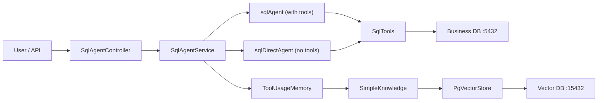
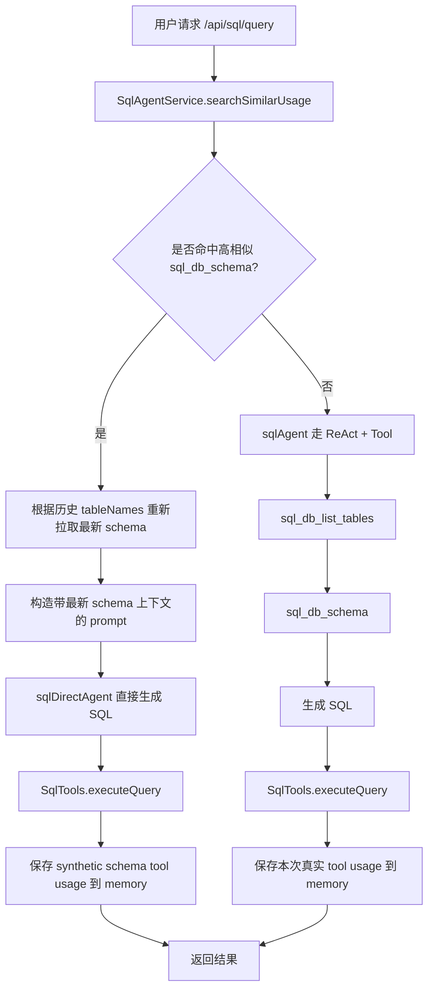
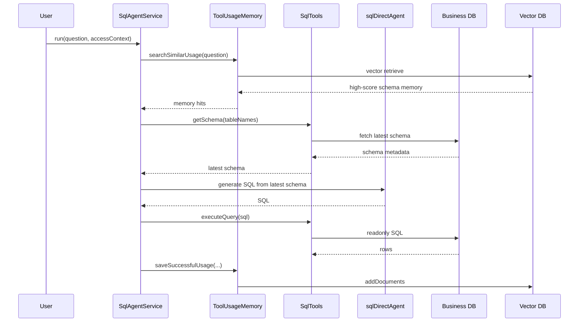
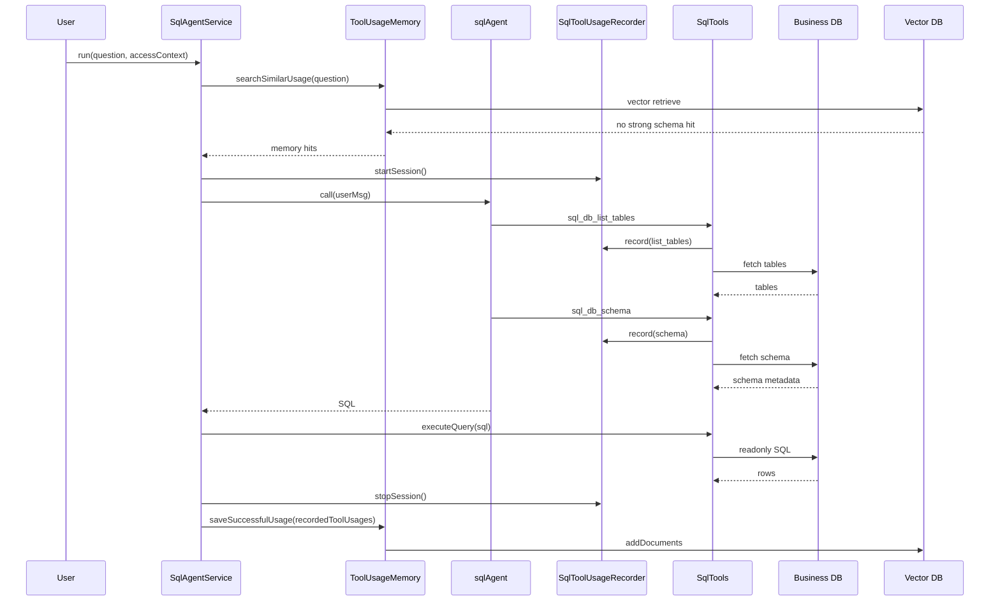

# SQL Agent Tool-Usage Memory 改造总结

## 1. 背景与目标

这次改造的目标，是把 SQL Agent 从“每次都重新探索表和 schema”的固定流程，升级为具备 **tool-usage memory** 的闭环能力：

1. 先检索历史上成功的问题与工具使用模式
2. 命中高价值历史时，尽量缩短本次 SQL 生成链路
3. 本次 SQL 成功执行后，把真实发生过的工具调用再次写回 memory

最终接入的入口是：

- [SqlAgentController.java](/Users/zhangshenghao/Documents/work_space/idea_project/agent_study/agent_scope_engine/src/main/java/com/example/agentscope/controller/SqlAgentController.java)
- [SqlAgentService.java](/Users/zhangshenghao/Documents/work_space/idea_project/agent_study/agent_scope_engine/src/main/java/com/example/agentscope/workflow/sqlagent/SqlAgentService.java)

---

## 2. 最终落地后的整体设计

### 2.1 关键设计点

这次最终落地版采用的是：

- AgentScope 官方 embedding / RAG 组件
- 独立 pgvector 向量库
- 业务库与向量库双数据源分离
- 服务层 shortcut + fallback 双路径编排
- 成功后按真实工具调用写入 memory

核心业务语义可以概括成一句话：

**先查历史 memory，如果命中高相似 schema 模式就直接预取最新 schema 并生成 SQL；否则走原始 ReAct + 工具链路；执行成功后把本次 tool usage 写回向量库。**

---

## 3. 当前真实组件结构

### 3.1 Agent 层

- `sqlAgent`
  - 带工具的 `ReActAgent`
  - 正常 fallback 场景下会调用 `sql_db_list_tables`、`sql_db_schema`
- `sqlDirectAgent`
  - 无工具的 `ReActAgent`
  - shortcut 场景下直接基于预取的最新 schema 生成 SQL

相关配置在：

- [SqlAgentConfig.java](/Users/zhangshenghao/Documents/work_space/idea_project/agent_study/agent_scope_engine/src/main/java/com/example/agentscope/workflow/sqlagent/SqlAgentConfig.java)

### 3.2 Tool-Usage Memory 抽象

- `ToolUsageMemory`
- `AgentScopeToolUsageMemory`
- `ToolUsageMemorySearchResult`
- `RecordedToolUsage`

相关代码在：

- [AgentScopeToolUsageMemory.java](/Users/zhangshenghao/Documents/work_space/idea_project/agent_study/agent_scope_engine/src/main/java/com/example/agentscope/workflow/sqlagent/memory/AgentScopeToolUsageMemory.java)

### 3.3 Tool Recorder

为了只保存“真实发生过的工具调用”，增加了 recorder：

- [SqlToolUsageRecorder.java](/Users/zhangshenghao/Documents/work_space/idea_project/agent_study/agent_scope_engine/src/main/java/com/example/agentscope/workflow/sqlagent/memory/SqlToolUsageRecorder.java)

当前记录的工具主要是：

- `sql_db_list_tables`
- `sql_db_schema`

### 3.4 SQL 工具

SQL Agent 实际使用的工具定义在：

- [SqlTools.java](/Users/zhangshenghao/Documents/work_space/idea_project/agent_study/agent_scope_engine/src/main/java/com/example/agentscope/workflow/sqlagent/tools/SqlTools.java)

这里除了提供：

- `sql_db_list_tables`
- `sql_db_schema`
- `executeQuery(...)`

还做了两件重要的事：

1. 每次 tool 调用时记录到 `SqlToolUsageRecorder`
2. 从候选表中剔除 `sql_tool_usage_memory`，避免 memory 表干扰模型选表

---

## 4. 双库架构

现在是明确的双库架构：

- 业务库：用于 SQL Agent 查 schema、执行 SQL
- 向量库：用于存储 `sql_tool_usage_memory`

对应配置在：

- [application.yml](/Users/zhangshenghao/Documents/work_space/idea_project/agent_study/agent_scope_engine/src/main/resources/application.yml)

### 4.1 业务库

通过 `spring.datasource.*` 配置，当前用于：

- `SqlTools.listTables()`
- `SqlTools.getSchema()`
- `SqlTools.executeQuery()`

### 4.2 向量库

通过 `workflow.sql.memory.pgvector.*` 配置，当前用于：

- `PgVectorStore`
- `SimpleKnowledge`
- `AgentScopeToolUsageMemory`

### 4.3 Mermaid 架构图



---

## 5. 最终请求流程

### 5.1 总体流程



### 5.2 Shortcut 时序图



### 5.3 Fallback 时序图



---

## 6. 核心实现说明

### 6.1 `SqlAgentService`

文件：

- [SqlAgentService.java](/Users/zhangshenghao/Documents/work_space/idea_project/agent_study/agent_scope_engine/src/main/java/com/example/agentscope/workflow/sqlagent/SqlAgentService.java)

关键能力：

1. `run(...)` 开头先检索 memory
2. 对命中的 `sql_db_schema` 结果做阈值判断
3. 高相似命中时走 `runWithPrefetchedSchema(...)`
4. 否则走 `runWithTools(...)`
5. SQL 成功执行后再保存 memory

当前用到的阈值：

- `MEMORY_SEARCH_LIMIT = 3`
- `MEMORY_SIMILARITY_THRESHOLD = 0.2`
- `MEMORY_SCHEMA_PREFETCH_THRESHOLD = 0.4`

### 6.2 `SqlToolUsageRecorder`

第一版 recorder 用的是 `InheritableThreadLocal`，后来发现 AgentScope 工具执行存在切线程场景，导致：

- 工具明明执行了
- `record(...)` 也被调到了
- 但会话里的记录丢失

最终改成了显式 session 模式：

- `startSession()` 返回 `sessionId`
- `stopSession(sessionId)` 获取并清理记录
- `clearSession(sessionId)` 异常清理

底层使用：

- `ConcurrentHashMap<String, List<RecordedToolUsage>>`
- `AtomicReference<String> activeSessionId`

这样解决了“工具实际调用了，但保存阶段拿不到记录”的问题。

### 6.3 `AgentScopeToolUsageMemory`

这一层最终没有继续自写 embedding / pgvector SQL，而是尽量贴近 AgentScope 官方实现。

当前依赖的是：

- `EmbeddingModel`
- `PgVectorStore`
- `SimpleKnowledge`

也就是说：

- 检索时：`knowledge.retrieve(question, config)`
- 保存时：`knowledge.addDocuments(documents)`

当前每条 `RecordedToolUsage` 会存成一条 `Document`，所以：

- 一次请求调了 2 个工具
- 向量表里就会新增 2 条记录

这和你在实际日志里看到的现象一致。

### 6.4 `SqlTools`

这里的关键职责有四个：

1. 暴露 `sql_db_list_tables`
2. 暴露 `sql_db_schema`
3. 执行本地只读 SQL
4. 强制租户隔离

其中租户隔离逻辑保证了：

- 非管理员请求必须按当前 `tenant_id` 访问
- 如果 SQL 中自己写了 `tenant_id`，还会校验是否与当前用户租户一致

---

## 7. 当前配置说明

### 7.1 业务库配置

```yaml
spring:
  datasource:
    driver-class-name: org.postgresql.Driver
    username: postgres
    password: postgres
    url: jdbc:postgresql://127.0.0.1:5432/postgres?currentSchema=haagen_dazs
```

### 7.2 向量库配置

```yaml
workflow:
  sql:
    memory:
      pgvector:
        url: jdbc:postgresql://127.0.0.1:15432/postgres?currentSchema=public
        username: postgres
        password: postgres
        table-name: sql_tool_usage_memory
```

### 7.3 Ollama embedding 配置

```yaml
workflow:
  sql:
    memory:
      embedding:
        base-url: http://127.0.0.1:11434
        api-key: dummy
        model-name: nomic-embed-text
        dimensions: 768
```

这里特别要注意：

- `dimensions` 必须和 embedding 模型实际输出维度一致
- 这次落地里，`nomic-embed-text` 实际返回的是 `768`

如果向量表曾经按错误维度创建过，比如 `1024`，就需要在向量库里删表重建：

```sql
DROP TABLE IF EXISTS sql_tool_usage_memory;
```

然后重启应用，让 `PgVectorStore` 按正确维度重新建表。

---

## 8. 当前日志如何解读

### 8.1 检索成功但没命中

```text
Searching SQL tool usage memory ...
SQL tool usage memory search completed, retrievedDocuments=0, filteredResults=0
```

说明：

- embedding 正常
- pgvector 检索正常
- 只是当前没有命中历史数据

### 8.2 保存成功

```text
Saving SQL tool usage memory ..., toolUsageCount=2
Saved SQL tool usage memory successfully ...
```

说明：

- 本次请求里记录到了 2 次工具调用
- 已经成功写入向量库
- 向量表里出现 2 条记录是正常现象

### 8.3 维度不一致

```text
Embedding dimension mismatch: expected=1024, actual=768
```

说明：

- 配置维度和模型实际输出维度不一致
- 需要对齐 `workflow.sql.memory.embedding.dimensions`
- 如果表已按错误维度建立，还要删表重建

现在代码里已经把这类错误提示补得更直接了，会明确提醒去检查维度和重建 `sql_tool_usage_memory`

---

## 9. 这次实际解决过的问题

### 9.1 Memory 命中了，但 Langfuse 链路没缩短

原因：

- 第一版只是把历史模式拼进 prompt
- prompt 仍要求必须先 `list_tables` 再 `schema`

修复：

- 服务层加 shortcut
- 命中高相似 `sql_db_schema` 时直接预取 schema
- 切到 `sqlDirectAgent`

### 9.2 AgentScope tool 调用了，但 recorder 里是空

原因：

- `InheritableThreadLocal` 在 AgentScope / Reactor 切线程时丢上下文

修复：

- recorder 改成显式 session 管理

### 9.3 向量库和业务库混在一起

原因：

- 初版默认共用一个 `spring.datasource`

修复：

- 业务库继续走 `spring.datasource`
- 向量库单独走 `workflow.sql.memory.pgvector.*`

### 9.4 embedding 维度不匹配

原因：

- Ollama `nomic-embed-text` 返回 `768`
- 初始默认维度配置成了 `1024`

修复：

- 默认维度改成 `768`
- 文档和日志里补充了删表重建提示

---

## 10. 当前状态

从最新日志来看，这条链路已经真正跑通：

1. 检索 memory 成功执行
2. 首次没命中时正常 fallback
3. `sql_db_list_tables` / `sql_db_schema` 被 recorder 记录
4. SQL 执行成功后写入 `sql_tool_usage_memory`
5. 向量表中出现与 tool usage 数量一致的记录

也就是说，现在已经具备完整闭环能力：

**检索历史 -> 生成/执行 SQL -> 成功后保存 -> 后续请求复用**

---

## 11. 后续可继续优化的方向

### 11.1 Shortcut 命中日志再明确一些

现在已经能从结果和 Langfuse 判断 shortcut 是否生效，但可以进一步加日志，例如：

- `Applying SQL memory shortcut with tableNames=...`
- `Falling back to tool-driven SQL planning`

### 11.2 提升并发隔离能力

当前 recorder 已经比 `ThreadLocal` 稳定很多，但仍是“单活跃 session”模型。

如果未来同一时刻存在多个 SQL 请求并发进入，可以继续升级成真正按请求隔离的多会话上下文。

### 11.3 Memory 去重与压缩

现在是“每个 tool usage 存一条 document”，简单直接，但数据量上来后可以考虑：

- 相同问题模式去重
- 高频 schema 模式聚合
- 定期归档低价值记录

---

## 12. 相关代码清单

- [SqlAgentController.java](/Users/zhangshenghao/Documents/work_space/idea_project/agent_study/agent_scope_engine/src/main/java/com/example/agentscope/controller/SqlAgentController.java)
- [SqlAgentConfig.java](/Users/zhangshenghao/Documents/work_space/idea_project/agent_study/agent_scope_engine/src/main/java/com/example/agentscope/workflow/sqlagent/SqlAgentConfig.java)
- [SqlAgentService.java](/Users/zhangshenghao/Documents/work_space/idea_project/agent_study/agent_scope_engine/src/main/java/com/example/agentscope/workflow/sqlagent/SqlAgentService.java)
- [SqlTools.java](/Users/zhangshenghao/Documents/work_space/idea_project/agent_study/agent_scope_engine/src/main/java/com/example/agentscope/workflow/sqlagent/tools/SqlTools.java)
- [AgentScopeToolUsageMemory.java](/Users/zhangshenghao/Documents/work_space/idea_project/agent_study/agent_scope_engine/src/main/java/com/example/agentscope/workflow/sqlagent/memory/AgentScopeToolUsageMemory.java)
- [SqlToolUsageRecorder.java](/Users/zhangshenghao/Documents/work_space/idea_project/agent_study/agent_scope_engine/src/main/java/com/example/agentscope/workflow/sqlagent/memory/SqlToolUsageRecorder.java)
- [application.yml](/Users/zhangshenghao/Documents/work_space/idea_project/agent_study/agent_scope_engine/src/main/resources/application.yml)
